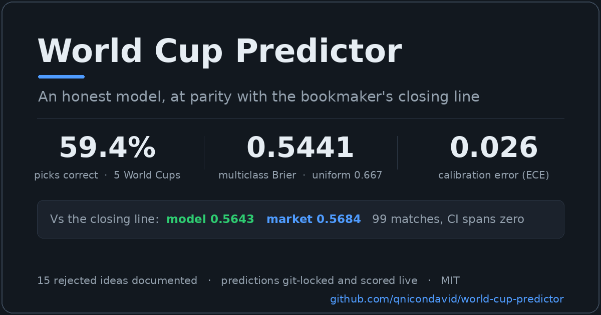

<p align="center">
  <a href="https://qnicondavid.github.io/world-cup-predictor/">
    
  </a>
</p>

A prediction model for FIFA World Cup matches, trained on 150+ years of
international football results (49,000+ matches, 1872 to today). Predictions are
served from a **Dixon-Coles goal model** with a squad market-value prior, locked
before kickoff, and scored against real results as the tournament unfolds. The
harder question behind the project was whether the probabilities are sharp enough
to beat a bookmaker's closing line. Tested against real closing odds from two
past World Cups, the model comes out level with the line: a small edge after
calibration, but well inside the margin of error, so not a demonstrated one. Seventeen other ideas that looked promising were tested and rejected out of sample, and they stay documented alongside the three that shipped. How
it gets there, and where it stops, is the rest of this README.

**Live demo: [qnicondavid.github.io/world-cup-predictor](https://qnicondavid.github.io/world-cup-predictor/)**

### At a glance

Every headline claim maps to its number, where it is proven, and the honesty label it has to keep. The status words are fixed: held-out result, parity, in progress, no verdict, not adopted.

| Claim | Number | Where proven | Status |
|---|---|---|---|
| Sharp enough to beat the closing line? | level: model 0.5643 vs market 0.5684 over 99 matches | [Against the closing line](#against-the-closing-line) | parity |
| Production model on five held-out World Cups | 0.5441 multiclass Brier over 320 matches (from 0.5717) | [More negative findings](#more-negative-findings-from-goal-model-research) | held-out result |
| Elo engine on the same 320 matches | 184/320 (57.5%), binary Brier 0.148 | [Track record on past World Cups](#track-record-on-past-world-cups) | held-out result |
| Squad market-value prior lift | 0.6123 to 0.5907 on 2022, fully out of sample | [Squad market value](#squad-market-value) | held-out result |
| Draw-transfer calibration | 0.5506 to 0.5441, all five held-out | [Draw-transfer calibration](#draw-transfer-calibration) | held-out result |
| Ideas tested and rejected | 17 documented, none adopted | [More negative findings](#more-negative-findings-from-goal-model-research) | not adopted |
| Live 2026 record (small sample) | tracked daily in the table below, still a small sample | [Live results](#live-results) | in progress |
| Model vs market consensus, live 2026 | the de-vigged cross-book average is ahead so far, but it is sharper than any single book, so treat the 2018/2022 parity as the calibrated read | [Against the closing line](#against-the-closing-line) | in progress |

The load-bearing figure is the held-out 0.5441. The live 2026 record is still a small sample, and the closing-line row is parity, not a win. Multiclass and binary Brier sit on scales about four times apart, so the two track-record rows are not directly comparable.

## Live results

A GitHub Action runs daily: it pulls fresh results, locks predictions for
upcoming fixtures with the production model, scores completed ones, and rewrites
the tables below automatically.

<!-- TRACKER:START -->
Δ is the total goal difference from the actual result (🎯 = exact), and Brier is multiclass.

**Record: 70/102 picks correct (68.6%), multiclass Brier 0.502, mean goal error 1.9** (uniform guess = 0.667)

| Date | Match | Winner | H/D/A % | Score (xG) | Result | Δ | Hit |
|---|---|---|---|---|---|---|---|
| Jul 15 | England vs Argentina | Argentina | 33/25/42% | 0-1 (1.0-1.1) | 1-2 | 2 | ✅ |
| Jul 14 | France vs Spain | Spain | 32/24/44% | 1-1 (1.1-1.2) | 0-2 | 2 | ✅ |
| Jul 11 | Norway vs England | England | 22/22/57% | 0-1 (0.9-1.5) | 1-2 | 2 | ✅ |
| Jul 11 | Argentina vs Switzerland | Argentina | 58/22/20% | 1-0 (1.5-0.8) | 3-1 | 3 | ✅ |
| Jul 10 | Spain vs Belgium | Spain | 57/21/21% | 1-0 (1.5-1.0) | 2-1 | 2 | ✅ |
| Jul 9 | France vs Morocco | France | 49/25/26% | 1-0 (1.1-0.9) | 2-0 | 1 | ✅ |
| Jul 7 | Argentina vs Egypt | Argentina | 71/19/10% | 1-0 (1.6-0.5) | 3-2 | 4 | ✅ |
| Jul 7 | Switzerland vs Colombia | Colombia | 27/23/50% | 1-1 (1.0-1.3) | 0-0 | 2 | ❌ |
| Jul 6 | United States vs Belgium | Belgium | 30/21/49% | 1-1 (1.3-1.5) | 1-4 | 3 | ✅ |
| Jul 6 | Portugal vs Spain | Spain | 29/23/48% | 1-1 (1.1-1.3) | 0-1 | 1 | ✅ |
| Jul 5 | Brazil vs Norway | Brazil | 62/19/19% | 1-1 (1.7-1.0) | 1-2 | 1 | ❌ |
| Jul 5 | Mexico vs England | England | 22/22/55% | 0-1 (0.9-1.5) | 2-3 | 4 | ✅ |
| Jul 4 | Canada vs Morocco | Morocco | 22/34/45% | 0-1 (0.7-1.1) | 0-3 | 2 | ✅ |
| Jul 4 | Paraguay vs France | France | 13/19/68% | 0-1 (0.6-1.7) | 0-1 | 0 🎯 | ✅ |
| Jul 3 | Australia vs Egypt | Australia | 36/35/30% | 0-0 (0.9-0.8) | 1-1 | 2 | ❌ |
| Jul 3 | Argentina vs Cape Verde | Argentina | 77/18/5% | 2-0 (2.1-0.4) | 3-2 | 3 | ✅ |
| Jul 3 | Colombia vs Ghana | Colombia | 64/24/12% | 1-0 (1.8-0.6) | 1-0 | 0 🎯 | ✅ |
| Jul 2 | Spain vs Austria | Spain | 58/25/17% | 1-0 (1.7-0.8) | 3-0 | 2 | ✅ |
| Jul 2 | Portugal vs Croatia | Portugal | 50/27/23% | 1-0 (1.5-0.9) | 2-1 | 2 | ✅ |
| Jul 2 | Switzerland vs Algeria | Switzerland | 40/28/32% | 1-1 (1.4-1.2) | 2-0 | 2 | ✅ |
| Jul 1 | England vs DR Congo | England | 57/30/14% | 1-0 (1.3-0.5) | 2-1 | 2 | ✅ |
| Jul 1 | Belgium vs Senegal | Belgium | 43/29/28% | 1-1 (1.4-1.0) | 3-2 | 3 | ✅ |
| Jul 1 | United States vs Bosnia and Herzegovina | United States | 64/21/15% | 2-0 (2.1-0.9) | 2-0 | 0 🎯 | ✅ |
| Jun 30 | Ivory Coast vs Norway | Norway | 30/30/40% | 1-1 (1.0-1.2) | 1-2 | 1 | ✅ |
| Jun 30 | France vs Sweden | France | 62/22/16% | 2-0 (2.0-1.0) | 3-0 | 1 | ✅ |
| Jun 30 | Mexico vs Ecuador | Mexico | 35/34/31% | 0-0 (0.9-0.9) | 2-0 | 2 | ✅ |
| Jun 29 | Brazil vs Japan | Brazil | 45/29/26% | 1-0 (1.4-1.0) | 2-1 | 2 | ✅ |
| Jun 29 | Germany vs Paraguay | Germany | 53/27/21% | 1-0 (1.6-0.9) | 1-1 | 1 | ❌ |
| Jun 29 | Netherlands vs Morocco | Morocco | 33/32/35% | 1-1 (1.0-1.0) | 1-1 | 0 🎯 | ❌ |
| Jun 28 | South Africa vs Canada | Canada | 19/30/50% | 0-1 (0.7-1.3) | 0-1 | 0 🎯 | ✅ |
| Jun 27 | Algeria vs Austria | Austria | 33/30/37% | 1-1 (1.3-1.3) | 3-3 | 4 | ❌ |
| Jun 27 | Jordan vs Argentina | Argentina | 2/12/86% | 0-3 (0.5-3.7) | 1-3 | 1 | ✅ |
| Jun 27 | Colombia vs Portugal | Colombia | 36/30/35% | 1-1 (1.3-1.3) | 0-0 | 2 | ❌ |
| Jun 27 | DR Congo vs Uzbekistan | Uzbekistan | 26/28/46% | 1-1 (1.1-1.5) | 3-1 | 2 | ❌ |
| Jun 27 | Panama vs England | England | 8/19/73% | 0-2 (0.7-2.5) | 0-2 | 0 🎯 | ✅ |
| Jun 27 | Croatia vs Ghana | Croatia | 81/15/4% | 3-0 (3.1-0.5) | 2-1 | 2 | ✅ |
| Jun 26 | Egypt vs Iran | Iran | 22/27/51% | 1-1 (1.0-1.7) | 1-1 | 0 🎯 | ❌ |
| Jun 26 | New Zealand vs Belgium | Belgium | 6/18/76% | 0-2 (0.6-2.8) | 1-5 | 4 | ✅ |
| Jun 26 | Cape Verde vs Saudi Arabia | Saudi Arabia | 29/29/42% | 1-1 (1.2-1.5) | 0-0 | 2 | ❌ |
| Jun 26 | Uruguay vs Spain | Spain | 10/21/69% | 0-2 (0.7-2.3) | 0-1 | 1 | ✅ |
| Jun 26 | Norway vs France | France | 19/26/56% | 0-1 (0.9-1.8) | 1-4 | 4 | ✅ |
| Jun 26 | Senegal vs Iraq | Senegal | 61/25/15% | 1-0 (2.0-0.8) | 5-0 | 4 | ✅ |
| Jun 25 | United States vs Turkey | Turkey | 27/28/45% | 1-1 (1.1-1.5) | 2-3 | 3 | ✅ |
| Jun 25 | Paraguay vs Australia | Paraguay | 37/30/33% | 1-1 (1.3-1.3) | 0-0 | 2 | ❌ |
| Jun 25 | Curaçao vs Ivory Coast | Ivory Coast | 9/20/71% | 0-2 (0.7-2.5) | 0-2 | 0 🎯 | ✅ |
| Jun 25 | Ecuador vs Germany | Germany | 33/30/38% | 1-1 (1.2-1.4) | 2-1 | 1 | ❌ |
| Jun 25 | Japan vs Sweden | Japan | 67/22/11% | 2-0 (2.3-0.7) | 1-1 | 2 | ❌ |
| Jun 25 | Tunisia vs Netherlands | Netherlands | 8/19/73% | 0-2 (0.7-2.6) | 1-3 | 2 | ✅ |
| Jun 24 | Mexico vs Czech Republic | Mexico | 65/23/11% | 2-0 (2.2-0.8) | 3-0 | 1 | ✅ |
| Jun 24 | South Africa vs South Korea | South Korea | 9/20/70% | 0-2 (0.7-2.4) | 1-0 | 3 | ❌ |
| Jun 24 | Canada vs Switzerland | Switzerland | 34/30/36% | 1-1 (1.3-1.3) | 1-2 | 1 | ✅ |
| Jun 24 | Bosnia and Herzegovina vs Qatar | Bosnia and Herzegovina | 52/27/21% | 1-0 (1.7-1.0) | 3-1 | 3 | ✅ |
| Jun 24 | Scotland vs Brazil | Brazil | 11/23/66% | 0-2 (0.8-2.2) | 0-3 | 1 | ✅ |
| Jun 24 | Morocco vs Haiti | Morocco | 78/17/5% | 2-0 (2.9-0.6) | 4-2 | 4 | ✅ |
| Jun 23 | Portugal vs Uzbekistan | Portugal | 68/22/10% | 2-0 (2.3-0.7) | 5-0 | 3 | ✅ |
| Jun 23 | Colombia vs DR Congo | Colombia | 76/18/6% | 2-0 (2.8-0.6) | 1-0 | 1 | ✅ |
| Jun 23 | England vs Ghana | England | 88/10/2% | 4-0 (4.0-0.4) | 0-0 | 4 | ❌ |
| Jun 23 | Panama vs Croatia | Croatia | 15/25/60% | 0-1 (0.9-2.0) | 0-1 | 0 🎯 | ✅ |
| Jun 22 | France vs Iraq | France | 84/13/3% | 3-0 (3.4-0.5) | 3-0 | 0 🎯 | ✅ |
| Jun 22 | Norway vs Senegal | Norway | 48/28/24% | 1-1 (1.6-1.1) | 3-2 | 3 | ✅ |
| Jun 22 | Argentina vs Austria | Argentina | 71/20/9% | 2-0 (2.4-0.7) | 2-0 | 0 🎯 | ✅ |
| Jun 22 | Jordan vs Algeria | Algeria | 17/25/58% | 0-1 (0.9-1.9) | 1-2 | 2 | ✅ |
| Jun 21 | Belgium vs Iran | Belgium | 49/27/23% | 1-1 (1.6-1.0) | 0-0 | 2 | ❌ |
| Jun 21 | New Zealand vs Egypt | Egypt | 22/27/52% | 0-1 (1.0-1.7) | 1-3 | 3 | ✅ |
| Jun 21 | Spain vs Saudi Arabia | Spain | 91/8/2% | 4-0 (4.5-0.4) | 4-0 | 0 🎯 | ✅ |
| Jun 21 | Uruguay vs Cape Verde | Uruguay | 77/18/6% | 2-0 (2.8-0.6) | 2-2 | 2 | ❌ |
| Jun 20 | Germany vs Ivory Coast | Germany | 63/24/12% | 2-0 (2.1-0.8) | 2-1 | 1 | ✅ |
| Jun 20 | Ecuador vs Curaçao | Ecuador | 87/11/2% | 3-0 (3.9-0.4) | 0-0 | 3 | ❌ |
| Jun 20 | Netherlands vs Sweden | Netherlands | 68/22/10% | 2-0 (2.3-0.7) | 5-1 | 4 | ✅ |
| Jun 20 | Tunisia vs Japan | Japan | 8/19/73% | 0-2 (0.7-2.6) | 0-4 | 2 | ✅ |
| Jun 19 | Scotland vs Morocco | Morocco | 17/25/58% | 0-1 (0.9-1.9) | 0-1 | 0 🎯 | ✅ |
| Jun 19 | Brazil vs Haiti | Brazil | 84/13/3% | 3-0 (3.4-0.5) | 3-0 | 0 🎯 | ✅ |
| Jun 19 | United States vs Australia | United States | 38/30/32% | 1-1 (1.4-1.2) | 2-0 | 2 | ✅ |
| Jun 19 | Turkey vs Paraguay | Turkey | 46/28/26% | 1-1 (1.5-1.1) | 0-1 | 1 | ❌ |
| Jun 18 | Czech Republic vs South Africa | Czech Republic | 59/25/16% | 1-0 (1.9-0.9) | 1-1 | 1 | ❌ |
| Jun 18 | Mexico vs South Korea | Mexico | 54/26/20% | 1-0 (1.8-1.0) | 1-0 | 0 🎯 | ✅ |
| Jun 18 | Switzerland vs Bosnia and Herzegovina | Switzerland | 76/18/6% | 2-0 (2.8-0.6) | 4-1 | 3 | ✅ |
| Jun 18 | Canada vs Qatar | Canada | 85/12/3% | 3-0 (3.6-0.5) | 6-0 | 3 | ✅ |
| Jun 17 | Portugal vs DR Congo | Portugal | 76/18/6% | 2-0 (2.8-0.6) | 1-1 | 2 | ❌ |
| Jun 17 | Uzbekistan vs Colombia | Colombia | 10/21/69% | 0-2 (0.7-2.3) | 1-3 | 2 | ✅ |
| Jun 17 | England vs Croatia | England | 51/27/22% | 1-1 (1.7-1.0) | 4-2 | 4 | ✅ |
| Jun 17 | Ghana vs Panama | Panama | 13/25/62% | 0-2 (0.8-2.1) | 1-0 | 3 | ❌ |
| Jun 16 | France vs Senegal | France | 66/23/11% | 2-0 (2.2-0.8) | 3-1 | 2 | ✅ |
| Jun 16 | Iraq vs Norway | Norway | 9/20/71% | 0-2 (0.7-2.5) | 1-4 | 3 | ✅ |
| Jun 16 | Argentina vs Algeria | Argentina | 72/19/8% | 2-0 (2.5-0.7) | 3-0 | 1 | ✅ |
| Jun 16 | Austria vs Jordan | Austria | 60/25/15% | 1-0 (2.0-0.9) | 3-1 | 3 | ✅ |
| Jun 15 | Belgium vs Egypt | Belgium | 63/24/13% | 2-0 (2.1-0.8) | 1-1 | 2 | ❌ |
| Jun 15 | Iran vs New Zealand | Iran | 65/24/11% | 2-0 (2.2-0.8) | 2-2 | 2 | ❌ |
| Jun 15 | Spain vs Cape Verde | Spain | 93/5/2% | 5-0 (5.0-0.3) | 0-0 | 5 | ❌ |
| Jun 15 | Saudi Arabia vs Uruguay | Uruguay | 8/20/72% | 0-2 (0.7-2.5) | 1-1 | 2 | ❌ |
| Jun 14 | Germany vs Curaçao | Germany | 88/10/2% | 4-0 (4.0-0.4) | 7-1 | 4 | ✅ |
| Jun 14 | Ivory Coast vs Ecuador | Ecuador | 14/25/61% | 0-2 (0.8-2.0) | 1-0 | 3 | ❌ |
| Jun 14 | Netherlands vs Japan | Netherlands | 36/30/35% | 1-1 (1.3-1.3) | 2-2 | 2 | ❌ |
| Jun 14 | Sweden vs Tunisia | Sweden | 42/29/29% | 1-1 (1.5-1.2) | 5-1 | 4 | ✅ |
| Jun 13 | Qatar vs Switzerland | Switzerland | 3/12/85% | 0-3 (0.5-3.6) | 1-1 | 3 | ❌ |
| Jun 13 | Brazil vs Morocco | Brazil | 46/28/26% | 1-1 (1.5-1.1) | 1-1 | 0 🎯 | ❌ |
| Jun 13 | Haiti vs Scotland | Scotland | 15/25/60% | 0-1 (0.8-2.0) | 0-1 | 0 🎯 | ✅ |
| Jun 13 | Australia vs Turkey | Turkey | 25/28/48% | 1-1 (1.1-1.6) | 2-0 | 2 | ❌ |
| Jun 12 | Canada vs Bosnia and Herzegovina | Canada | 75/18/7% | 2-0 (2.7-0.6) | 1-1 | 2 | ❌ |
| Jun 12 | United States vs Paraguay | United States | 36/30/34% | 1-1 (1.3-1.3) | 4-1 | 3 | ✅ |
| Jun 11 | Mexico vs South Africa | Mexico | 75/16/9% | 2-0 (2.0-0.6) | 2-0 | 0 🎯 | ✅ |
| Jun 11 | South Korea vs Czech Republic | South Korea | 44/23/33% | 1-1 (1.2-1.2) | 2-1 | 1 | ✅ |

**Locked for upcoming matches:**

| Date | Match | Winner | H/D/A % | Score (xG) |
|---|---|---|---|---|
| Jul 18 | France vs England | France | 44/24/32% | 1-1 (1.1-1.1) |
| Jul 19 | Spain vs Argentina | Spain | 46/24/29% | 1-1 (1.1-1.0) |

<!-- TRACKER:END -->

### Championship odds

<!-- TITLE:START -->
The model's championship odds from 10,000 Monte Carlo simulations, updated 2026-07-17. They inherit the simulator's simplifications (knockout bracket paired in schedule order, games as neutral with no draws), so read them as the model's view, not a hard forecast.

| # | Team | Title | Final | Semis |
|---|---|---|---|---|
| 1 | Spain | 51.2% | 100.0% | 100.0% |
| 2 | Argentina | 48.8% | 100.0% | 100.0% |

<!-- TITLE:END -->

## Track record on past World Cups

Before predicting 2026, the model is validated on five World Cups it never saw
during training. For each tournament it trains only on matches played before it,
then predicts every match in it, the same information regime as predicting live.

The table below scores the **Elo win-probability engine** (its tuned configuration
against the untuned baseline) with a two-outcome Brier that counts a draw as half a
win. That is a coarser, different metric from the three-class **multiclass Brier**
(around 0.54) reported for the production Dixon-Coles model elsewhere here: the two
sit on scales roughly four times apart and are not directly comparable.

| Tournament | Tuned model | Baseline |
|---|---|---|
| World Cup 2022 | 32/64 (50.0%), Brier 0.183 | 34/64 (53.1%), Brier 0.181 |
| World Cup 2018 | 37/64 (57.8%), Brier 0.159 | 34/64 (53.1%), Brier 0.167 |
| World Cup 2014 | 39/64 (60.9%), Brier 0.135 | 39/64 (60.9%), Brier 0.150 |
| World Cup 2010 | 35/64 (54.7%), Brier 0.146 | 32/64 (50.0%), Brier 0.148 |
| World Cup 2006 | 41/64 (64.1%), Brier 0.119 | 42/64 (65.6%), Brier 0.129 |
| **Combined (320)** | **184/320 (57.5%), Brier 0.148** | 181/320 (56.6%), Brier 0.155 |
| Coin-flip reference | 50%, Brier 0.250 | n/a |

The tuned model beats both the baseline and a coin flip across the combined 320
matches. One pattern stands out: **World Cups are getting harder to predict.** The
binary Brier rises almost monotonically from 0.119 (2006) to 0.183 (2022); the field
has genuinely tightened.

## How it works

The production model is **Dixon-Coles**: every team gets a separate **attack**
and **defence** rating, fit by weighted maximum likelihood on all of
international history, with a home-advantage term, the low-score correlation
correction (`rho`) that fixes Poisson's under-counting of 0-0 and 1-1,
exponential time decay (2-year half-life), and shrinkage toward the average for
rarely-seen teams. Squad market value is folded in as a **prior** on those
ratings. From the fitted attack/defence pair the model produces a full scoreline
distribution, and from that the win/draw/loss probabilities and most-likely
score you see above.

```
data/results.csv -> MatchCsvParser -> Dixon-Coles fit (+ value prior) -> scoreline distribution -> predictions
```

The original engine is an **Elo rating system**: every team starts at 1500, and
after each match ratings shift by `K * (actual - expected)` with K scaled by
match importance and a home boost at non-neutral venues. Elo still drives the
Monte Carlo title simulation and remains the baseline every goal model is
measured against.

## Why you can trust it

Every figure in the track record above comes from
World Cups the model never trained on, predicting each match before its result,
so nothing is fit to the games it is judged on. The live 2026 picks follow the
same discipline.

Live predictions are written to
`predictions/predictions.csv` before kickoff and never changed; the git history
is the audit trail. A prediction made under an older model is preserved as-is
and never re-locked.

Several intuitive ideas were tested
honestly and did not earn their place, and they stay documented because that is
why the rest can be believed:

- **Rest-days advantage**: no out-of-sample improvement (`--rest`).
- **Bivariate covariance term**: adds nothing over Dixon-Coles (Brier 0.573 vs
  0.574).
- **Temperature scaling**: sharpened in-sample but made held-out 2022 worse on
  every metric, so none is applied.
- **Annual regression toward the mean**: never helped at any strength;
  national-team strength is more persistent than folklore suggests.

What did survive: goal-margin scaling (combined Brier 0.148 vs 0.155) and a
small, tuned squad-value prior.

### More negative findings from goal-model research

Every banked idea in one place first, then the write-ups. Δ Brier is the change in combined held-out multiclass Brier against the relevant baseline, where negative means lower Brier, so it would have helped; a near miss stays rejected. This table is the source the site's rejected-ideas panel reads from, so the two cannot drift apart. Full detail for each row is in the linked section below.

| Idea | Δ Brier | 95% CI | Verdict | Detail |
|---|---|---|---|---|
| Cross-confederation strength correction | -0.0050 | [-0.0120, +0.0050] | rejected: worsens the expanded surface | [detail](#more-negative-findings-from-goal-model-research) |
| Favourite recalibration | not gated | [-0.0130, +0.0010] | not adopted | [detail](#more-negative-findings-from-goal-model-research) |
| Stronger recent-form nudge (lambda 0.60) | -0.0048 | [-0.0096, +0.0004] | rejected: reverses on the expanded surface | [detail](#recent-form) |
| Opponent-adjusted recent-form residual | -0.0020 | [-0.0042, +0.0001] | near miss, does not clear the gate | [detail](#more-negative-findings-from-goal-model-research) |
| Real published World Cup squads | +0.0026 | [-0.0017, +0.0070] | not adopted | [detail](#squad-market-value) |
| Half-life retune (~3 years) | -0.0030 | n/a | inside the noise floor | [detail](#more-negative-findings-from-goal-model-research) |
| Match-importance weighting | +0.0013 | [-0.0015, +0.0041] | not adopted | [detail](#more-negative-findings-from-goal-model-research) |
| Bivariate covariance term | -0.0010 | n/a | adds nothing | [detail](#goal-models) |
| Elo + Dixon-Coles ensemble blend | +0.0007 | [0.0000, +0.0019] | dead | [detail](#more-negative-findings-from-goal-model-research) |
| Symmetric draw scaling | 0.0000 | n/a | no-op | [detail](#more-negative-findings-from-goal-model-research) |
| Lineup-weighted squad value | not gated | n/a | no signal | [detail](#more-negative-findings-from-goal-model-research) |
| Dynamic / state-space ratings | not gated | n/a | inside the noise floor | [detail](#more-negative-findings-from-goal-model-research) |
| Temperature scaling | not gated | n/a | not adopted | [detail](#why-you-can-trust-it) |
| Rest-days advantage | not gated | n/a | no out-of-sample gain | [detail](#rest-days-differential-experimental) |
| Annual regression to the mean | not gated | n/a | never helped | [detail](#why-you-can-trust-it) |
| Injury / availability at kickoff | not gated | n/a | no-go (feasibility probe) | repo probe |

Six of these were tested on the five held-out World Cups (320 matches, 2006-2022)
and did not clear the bar:

- **Elo + Dixon-Coles ensemble blend**: leave-one-tournament-out cross-validation
  drove the learned weight to near-pure Elo in every fold. The blend scored
  +0.0007 worse than plain Elo on the held-out set (95% CI [0.0000, +0.0019]);
  the confidence interval never favors the blend. Dead.
- **Symmetric draw scaling**: a single multiplicative factor k on the draw
  probability, tuned via LOTO-CV, reverted to k=1.0 (no-op) every time, and
  held-out Brier did not move. Scaling every draw up or down uniformly changes
  nothing, because the freed probability flows back to both sides in proportion.
  That reads like a dead end, and for the symmetric version it is. The mistake was
  assuming the fix had to be symmetric: the model does over-produce draws (mean
  predicted 0.283 vs a 0.225 base rate), but the surplus belongs on the favourite,
  not split evenly. The asymmetric version of this idea, the draw-transfer under
  Methodology, is the one calibration change that later cleared the gate.
- **Half-life retune**: longer decay half-lives (~3 years) lean slightly
  better; pooled held-out Brier improved by roughly -0.003 (0.595 vs 0.598).
  That delta is inside the approximately plus-or-minus 0.015 to 0.020 noise
  floor implied by block-bootstrap CIs over five tournaments, so the change
  is not adopted as a standalone improvement.
- **Match-importance weighting**: down-weighting friendlies (0.5) and up-weighting
  World Cup finals (1.25) in the Poisson ratings fit, as fixed a-priori weights.
  The variant scored 0.5454 against the baseline 0.5441, a mean paired delta of
  -0.0013 with a 95% CI of [-0.0041, +0.0015] that spans zero, and only two of the
  five tournaments improved. Resolution fell rather than rose, the opposite of the
  intended effect. Reproduce with `--importance-export`, then `verify.py --paired
  export_predictions_form.csv export_predictions_importance.csv`. Not adopted.
- **Stronger recent-form nudge (lambda)**: a leave-one-tournament-out sweep
  (`--form-tune-loto`) of the form coefficient found a clean interior optimum near
  lambda 0.60, well above the shipped 0.20, lowering pooled held-out Brier from 0.5441
  to 0.5393 and improving four of five tournaments. But the paired block-bootstrap CI
  is [-0.0004, +0.0096], grazing zero, and 2022 regresses, so it just misses the gate.
  That 320-match near miss did not survive Phase 1. Re-gated on a pre-registered
  2,180-match surface (the five World Cups plus 65 continental-final editions since
  2000), the World Cup gain reverses: lambda 0.60 is 0.0064 worse than the shipped
  0.20, paired 95 percent interval [+0.0026, +0.0103], entirely on the worse side,
  while 0.20 sits at the surface optimum and form-off ties it. The World Cup optimum
  was overfitting to 320 matches. Reproduce the sweep with `--form-tune-loto`, or the
  surface re-gate with `--expanded-export=0.60` then `verify.py --expanded-paired`;
  full detail in research/phase1_results.md. Rejected.
- **Real World Cup squads in place of the value proxy**: the shipped prior sums
  the 26 most valuable players per nation; this used the actual squads (23
  players, 26 in 2022) for all five tournaments, taken from Wikipedia and valued
  through the same Transfermarkt lookup. Transfermarkt's player valuations run
  too thin before 2014 to value those older squads fairly, so the gate ran on
  2014, 2018 and 2022, where about 80 percent of each squad carries a valuation.
  The real squads did not beat the proxy: combined Brier 0.5605 for the proxy
  against 0.5631 for the real squads, a mean paired delta of -0.0026 with a 95% CI
  of [-0.0070, +0.0017] that spans zero, and two of the three tournaments worse.
  For a strong side the best players get called up anyway. In raw euros the proxy
  runs about a quarter to a third above the real 23, partly because a fifth of
  each real squad has no valuation, but the prior standardises the log of squad
  value, where the two correlate about 0.99, so swapping one for the other barely
  moves what the model sees. The unvalued players only pull the real totals down,
  so if anything the test is stacked toward the real squads and still finds
  nothing. The parsed squads
  are in `data/wc_squads.csv` (3,775 players); `research/build_realsquad_values.py`
  rebuilds the value table, and the gate swaps `data/market_values_realsquad.csv`
  in for `market_values.csv` before `verify.py --paired`. Not adopted. A related check
  on the value data itself, an attack-versus-defence value split and a squad-age term
  built from the Transfermarkt positions, was tested the same way and also found nothing
  that transfers: the split and age carry information the total value misses (they are
  not the 0.99 wall), but neither predicts the held-out outcome residual, pooled
  correlations near zero with signs that flip across 2014, 2018 and 2022
  (research/phase2_results.md).

A seventh idea showed real structure but was absorbed by the value prior. A
cross-confederation strength correction estimates a per-confederation-pair
goal-difference residual from training data and applies it to
inter-confederation matchups. On the Python Dixon-Coles baseline (no value
prior) it improved combined Brier by roughly -0.016 (95% CI excludes zero, all
five World Cups negative, gain in resolution). But re-measured on the
production model through the export bridge (--verify-export, scored with
verify.py --score), the gain collapsed to about -0.005 with a 95% CI of
[-0.012, +0.005] that spans zero, and one tournament reversed sign. The
squad-value prior and confederation strength are partly redundant, since rich
squads cluster in the strong confederations, so the prior already absorbs
roughly two-thirds of the effect. Phase 1 then re-gated it on a pre-registered
2,180-match surface, and there it is not merely absorbed but actively harmful:
0.0020 worse at scale 0.5 and 0.0047 worse at scale 1.0, both paired intervals
excluding zero on the worse side, and worst of all on the 494 inter-confederation
matches it targets, 0.0089 then 0.0209 worse. Rejected. The export bridge and
verification harness (research/verify.py) built to settle this are kept, since
every future idea is judged the same way; the full re-gate is in
research/phase1_results.md. The in-fit version of the same idea, estimating the offsets
jointly with the ratings rather than after them, was ruled out without building it: a
free per-confederation-pair probability offset, which is more expressive than any in-fit
rating offset, only worsens the production model out of sample (research/phase2_results.md),
so there is nothing left for the in-fit fit to gain.

Three later ideas were tested the same way and also did not clear the gate.
**Favourite recalibration** (a leave-one-tournament-out map that sharpens the
favourite's probability) cut reliability but traded away resolution and reversed
sign on one tournament, leaving a 95% CI of [-0.013, +0.001] that grazes zero:
the temperature lesson a third time, not adopted. **Dynamic / state-space
ratings** (a two-timescale strength blend) gave at most a noise-floor Brier
change with no certifiable resolution lift. **Lineup-weighted squad value** (the
actual starting XI valued as-of the match date, sourced from StatsBomb open data
for 2018 and 2022) carried only a weak residual signal (correlation 0.06) that
did not transfer between tournaments and cost resolution out of sample, so the
harder 2006-2014 backfill was not pursued; the collectors live in
research/fetch_lineups.py and research/lineup_value.py as a record of the
attempt.

The most recent test, and the closest any rejected idea has come, is an
opponent-adjusted recent-form residual (Phase 3, research/phase3_results.md). The
shipped form nudge averages raw goals conceded over the last five matches, which is
confounded by schedule strength; this variant measures each side's recent defence
against what the fitted model expected it to concede against that opponent. On the
2,180-match expanded surface it beats the shipped raw feature at the same nudge
strength by 0.0017, with a 95 percent interval of [0.0004, 0.0030] that clears zero,
the first candidate to manage that, and the gain concentrates in intra-confederation
matches where recent form is comparable. It still does not ship. Leave-one-tournament-out
selection over the nudge grid lands on a stronger coefficient (0.40) whose interval
grazes zero, and the World Cup 320 guard trips (2006 regresses past the noise floor at
0.20, 2022 blows out at higher coefficients). The opponent-adjustment is the right idea
and the honest pooled improvement is real but tiny (0.5623 to 0.5617), too small to
certify at the operating point the data selects. The form channel is closed with this
result on the record.

Phase 3 then closed with a direct test of whether any structure remains at all. A
learned residual probe (research/phase3_results.md) trained a gradient-boosted model
leave-one-tournament-out on the production model's own locked predictions plus twelve
pre-kickoff features: the rate gap, total goals, value gap, the opponent-adjusted form
residual, confederation pairing, rest-days difference, and neutrality. Handed the
production probabilities as inputs, it could not match the production model out of
sample, let alone beat it: held-out multiclass Brier 0.5880 against production's 0.5623.
A label-shuffle canary landed at 0.6829, near the base-rate floor and far above the
probe, and per-tournament isolation held on all seventy folds, so the null is clean
rather than an artifact. The attribution leaned on the rate gap, total, and value gap,
the model's own core signals, and the confederation features it was handed produced no
out-of-sample gain, the same verdict Phase 1 reached by a different route. There is no
exploitable structure left for this model class to capture.

A final consistency check closed Phase 3. The live tracker refits the ratings before
each match day, while the backtest fits once per tournament, so the headline could in
principle misrepresent the live regime. Measured directly, it does not: the refit
regime scores 0.5446 on the held-out World Cups against the fit-once 0.5441, a paired
delta of -0.0004 with a 95 percent interval that spans zero. The two are statistically
the same, because the form nudge already carries in-tournament information, so the
fit-once headline is kept as the cleaner and fully reproducible number
(research/phase3_results.md).

One research idea was checked and not attempted: measuring form in expected goals
instead of raw goals. The only licensable xG source, StatsBomb open data, covers
tournaments but carries no international friendlies or qualifiers in any year, which
are exactly the matches a last-five recent-form window is built from, so the feature
cannot be constructed or validated on public data. It is parked as not feasible
(research/phase3_results.md).

The most ambitious data experiment was EA Sports FC player ratings as a second
squad-quality signal beside market value (notes/model/EA_RATINGS_PLAN.md,
research/phase2_results.md). It was the only idea in the campaign to pass the cheap kill
tests: the EA overall rating correlates 0.905 with standardized log squad value and the
goalkeeper rating only 0.668, so it carries information the value prior misses, and teams
EA rates above their value beat the model's expectation on 2018 and 2022. Built into the
prior as a default-off multi-signal blend and gated leave-one-tournament-out on a
768-match EA-covered surface (the 2018 and 2022 World Cups plus continental finals 2015
to 2023), it did not clear. The overall term worsened the surface; a separately
pre-registered goalkeeper-only term was neutral to slightly worse on it. Both, though,
helped the World Cups specifically, the goalkeeper term by up to 0.0038, which is the
honest residue: the one signal genuinely independent of value helps World Cup prediction
but does not survive dilution across the broader surface chosen for statistical power.
Not shipped; the committed data aggregate and the multi-signal prior are kept for a
future edition with wider coverage.

Across the campaign three changes survived this gate: the strengthened value
prior, the recent-form nudge, and a draw-transfer calibration, together moving the
held-out Brier from 0.5717 to 0.5441. The first two mostly bought resolution,
sharper separation between outcomes. The third went back for a calibration defect
the earlier symmetric tests had written off, once the decomposition made clear the
leftover error was draws landing on the wrong side rather than too much draw mass
overall. Everything else, the recalibration maps and the extra rating machinery,
kept washing out. Only changes that add real signal or fix a real bias held up out
of sample.

## Methodology in depth

### Draw modelling

The Elo expected score conflates winning and drawing (E = P(win) + P(draw)/2).
To split it, P(draw) is estimated empirically: replaying the post-1980
internationals through the model shows the draw rate falling from ~30% between equal
teams to ~2% at a 600-point rating gap. `DrawModel` interpolates that observed
curve (rounded and lightly smoothed in the sparse high-gap bins) and splits E into
explicit win/draw/loss probabilities. The `--draw-curve` command regenerates the
curve from data and reproduces the shipped table to within about 0.015 over the
~37,400 post-1980 internationals in the current dataset. An honest
limitation: the model never makes "draw" its single most likely outcome (~30% is
the ceiling), so the draw model improves probabilities, not picks;
bookmakers share this property.

### Goal models

A goal model gives every team a separate attack and defence rating and predicts
the scoreline, yielding win/draw/loss probabilities from first principles
rather than from an empirical draw curve. Three live under
`com.david.worldcup.goals`, comparable head-to-head via `--goals`:

- **Dixon-Coles**: the production model (described above).
- **Bivariate Poisson**: the same attack/defence fit plus a shared component
  that makes the two scores positively correlated.
- **Elo-Poisson**: the lightweight option, reusing the Elo gap and mapping it to
  two Poisson rates by regression.

Scored on 320 World Cup matches (2006-2022), train-before-each-tournament:

| Model | Picks correct | Combined multiclass Brier |
|---|---|---|
| Dixon-Coles | 183/320 (57.2%) | 0.574 |
| Bivariate Poisson | 183/320 (57.2%) | 0.573 |
| Elo-Poisson | 178/320 (55.6%) | 0.575 |
| Elo + DrawModel (baseline) | 178/320 (55.6%) | 0.576 |
| Uniform reference | n/a | 0.667 |

The goal models edge the Elo baseline modestly. The edge is uneven across
tournaments, so an **Elo + Dixon-Coles ensemble** (averaging the two probability
vectors) is also wired into `--goals`. This fixed average is a different
construction from the learned blend banked as dead above, where
leave-one-tournament-out drove the weight toward near-pure Elo; the average lands
inside the noise floor of plain Dixon-Coles, so read it as a reference, not a win.
The fitter itself is validated against
`research/goal_models.py`: on data from a known Dixon-Coles process it recovers
team attack strengths at correlation 0.99.

### Squad market value

Elo and goal ratings are lagging: they learn strength from results. Squad
market value is a leading signal. The model folds it in as a **prior on the
Dixon-Coles attack/defence ratings**: a richer-than-average squad gets a higher
attack and lower (better) defence prior, and each team's fitted rating is shrunk
toward that prior. It reads `data/market_values.csv` (`team,as_of,value_eur`);
lookups always take the most recent value on or before the match date, so
nothing leaks from the future.

`--values-tune` grid-searches the weights on 2006-2018 and validates once on
held-out 2022. Held-out testing through the verification harness showed the
value prior was under-exploited, so a widened sweep was run; the tuned prior
(`globalWeight 0.40, sparseWeight 0, valueScale 0.60`, roughly double the
earlier setting) beats plain Dixon-Coles out of sample (multiclass Brier
**0.5907 vs 0.6123** on 2022) and is now the default. Scored across all five
held-out World Cups through the export bridge, it cuts the production model's
combined Brier from 0.5717 to 0.5566, with the gain split between better
calibration (reliability 0.0226 to 0.0136) and sharper separation (resolution
0.0914 to 0.0957). Caveats kept in view: the weights were tuned on 2006-2018, so four
of the five tournaments in this 0.5717 to 0.5566 comparison overlap the tuning set and
only the 2022 leg (0.6123 to 0.5907) is fully out-of-sample; four of five tournaments
improve while 2010 is marginally worse; and the sparse-team lever still earns nothing.
A leave-one-tournament-out re-tune (`--values-tune-loto`) confirms the fixed weights are
not overfit: their pooled held-out Brier is 0.5566, and letting the grid re-tune per
fold does slightly worse out of sample (0.5594), with no single weighting winning a
majority of folds, so the single-split choice holds up. The
shipped `market_values.csv` is the real, full Transfermarkt-derived table (933
rows, 182 teams), rebuildable byte-for-byte from the dumps in `data/transfermarkt/`
via `research/build_market_values.py`. Each snapshot is a top-26-by-value proxy squad
(players of a nationality valued within two years of the date), not a published
23/26-man roster.

### Recent form

Squad value and the fitted ratings move slowly; recent results do not. A
`FormAdjuster` nudges the win/draw/loss probabilities by each side's recent
defensive form, the mean goals conceded over its last 5 matches before kickoff
(leakage-safe, since only prior matches count). Measured on the production
model's held-out predictions through the export bridge, a conservative
coefficient cuts the combined Brier from 0.5566 to 0.5506, with the gain almost
entirely in resolution (sharper separation, the component the model was losing
to) and improving in all five tournaments. The coefficient (0.20) was set by judgment;
a later leave-one-tournament-out sweep (`--form-tune-loto`) found a clean interior
optimum near 0.60 that lowers pooled held-out Brier to 0.5393 and improves four of five
tournaments, but its paired CI [-0.0004, +0.0096] grazes zero (2022 regresses), so the
stronger nudge just misses the gate on those 320 matches, and a pre-registered
re-gate on a 2,180-match surface then reversed it (lambda 0.60 worse by 0.0064),
so the conservative 0.20 is kept and is now the surface optimum (see negative
findings). It is shipped and wired into the live tracker, so daily predictions carry it. One caveat: the nudge moves the
probabilities, not the expected goals, so the most-likely-score column still
comes from the raw model. That raw scoreline carries its own measured bias:
leave-one-tournament-out, the model's expected total goals run about 0.45 below the
actual at the 2018 and 2022 World Cups, near zero in 2006 and widening since, so the
displayed expected goals and most-likely scores read low at recent tournaments. This
shows up only in the scorelines on display, not in the win, draw, and loss
probabilities or the Brier.

### Draw-transfer calibration

The model over-produces draws. Averaged over the five held-out World Cups it puts
about 0.283 on the draw where the real rate is 0.225, a bias Dixon-Coles inherits
from its low-score correction. The obvious fix, scaling the draw probability down,
does nothing out of sample (see the symmetric-scaling note under negative
findings), so for a while this looked settled.

What the symmetric test missed showed up in the closing-line backtest. Split by
match type, the model lost most to the market on moderate favourites, matches
priced around 45 to 65 percent for one side. A Murphy decomposition put that loss
in reliability rather than resolution and traced it to the home and draw
probabilities. The draw mass was not simply too large; it was sitting between the
two teams when it belonged on the favourite.

The fix moves a fixed fraction of each match's draw probability onto whichever side
the model already favours, then renormalises. The fraction, about 0.21, is fit
leave-one-tournament-out and stays stable across folds. Scored the same way as
every other change, it cuts the held-out Brier from 0.5506 to 0.5441, improves
all five tournaments (2010 only marginally), and the block-bootstrap interval on
the gain clears zero. The whole improvement is reliability, the exact component
the decomposition flagged. Direction is what makes it work: a band-restricted
version and a symmetric split both failed the gate, and only the global,
favourite-directed transfer passed it. It ships as `Calibration.transferDraw` and
is applied in the export and the live tracker, so daily predictions carry it.

### Calibration

`--calibrate` audits the production model on the held-out World Cups: reliability
bins, log-loss, multiclass Brier and expected calibration error (ECE), plus a
temperature fit. The finding: the value-stage model is mildly **under-confident** (ECE ≈ 0.06), but
the calibration direction is not stable across tournaments, so no temperature is
applied and the raw probabilities ship as-is. After the recent-form and draw-transfer
steps the shipped model is better calibrated, ECE 0.026 on the same held-out matches
(`python research/verify.py --score research/export_predictions_form.csv`). The
practical consequence for any betting layer is to demand a margin of safety and size
conservatively.

### Against the closing line

This is the question the project was built around, so it earns a real answer
rather than a mock one.

The value-betting loop is simple. `--bets` reads bookmaker odds, strips the
overround to fair probabilities, and compares them to the model for each fixture.
When an outcome's expected value clears a threshold it is flagged and sized by
fractional Kelly, on a conservative default policy (a 5% edge floor, quarter-Kelly,
capped at 5% of bankroll) because the calibration wobbles between tournaments.

The hard part was getting real closing odds to test against, which international
football mostly lacks. A scrape of the 2018 and 2022 World Cups filled the gap. The
model's held-out predictions were then scored against the de-vigged closing line on
the same matches, which is the only fair comparison. Across 99 matches:

| World Cups | Matches | Model Brier | Market Brier | Difference |
|---|---|---|---|---|
| 2018, 2022 | 99 | 0.5643 | 0.5684 | -0.0042 |

The model edges the line by a hair, but the margin sits inside one standard error
and the block-bootstrap interval over the tournaments spans zero. The honest read
is parity: after the draw-transfer calibration the model is level with the sharpest
line available, leaning very slightly favourable, without a gap wide enough to call
an edge. For a model built on public data, reaching the closing line is already near
the ceiling.

The paper ROI made the same point from the other side. A naive run of the value
policy showed a positive return, but almost all of it came from a few longshots
that happened to land, and one of those was a data bug: neutral-venue matches label
home and away differently across sources, and a position-wise join once paid a
favourite's win at the underdog's price. Joining on the unordered team pair removed
the phantom, and what remains is what the Brier numbers imply, small disagreements
with the market that carry no reliable edge.

The live test runs forward. `research/fetch_odds_live.py` captures pre-kickoff
prices, flags value bets under the same policy, and appends them to a never-edited
ledger; `research/settle_bets.py` grades them and measures closing-line value. A
verdict there needs a few hundred settled bets, so it is a long-run instrument, not
a result yet. The early returns match the backtest: the first settled bets, all
contrarian draw-or-underdog flags, lost, while the model's straight match picks
came in.

### Rest-days differential (experimental)

`--rest` tests whether a team with more recovery than its opponent has an edge
the rating misses: it adds rating points per day of rest advantage (capped at 10
days) and measures held-out Brier against the unadjusted baseline. It needs no
new data, so it is fully reproducible. As noted above, the effect did not survive
out of sample.

## Run it

Requires JDK 17+ and Maven.

```bash
mvn test                            # run the unit test suite
mvn compile exec:java               # replay history, print Elo top 15 + sample predictions
mvn compile exec:java -Dexec.args="--backtest"   # evaluate on the held-out World Cups
mvn compile exec:java -Dexec.args="--tune"       # hyperparameter grid search
mvn compile exec:java -Dexec.args="--track"      # lock/score predictions, update README
mvn compile exec:java -Dexec.args="--simulate"   # Monte Carlo: 10,000 tournament sims
mvn compile exec:java -Dexec.args="--upcoming"   # every fixture with win/draw/loss probs
mvn compile exec:java -Dexec.args="--predict=France,Argentina"   # any matchup
mvn compile exec:java -Dexec.args="--goals"      # goal models vs Elo: held-out comparison
mvn compile exec:java -Dexec.args="--rest"       # does a rest-days edge improve the model?
mvn compile exec:java -Dexec.args="--values"     # does squad market value improve the model?
mvn compile exec:java -Dexec.args="--values-tune" # grid-search the market-value prior weights
mvn compile exec:java -Dexec.args="--values-tune-loto" # leave-one-tournament-out re-tune of those weights
mvn compile exec:java -Dexec.args="--calibrate"  # reliability / log-loss audit + temperature fit
mvn compile exec:java -Dexec.args="--bets"       # value bets vs bookmaker odds (mock odds)
mvn compile exec:java -Dexec.args="--verify-export" # write held-out predictions to research/export_predictions_form.csv (production 0.5441) and _value.csv (value-prior stage 0.5566)
mvn compile exec:java -Dexec.args="--draw-curve"  # reproduce DrawModel's draw-rate curve from data (since 1980)
```

(PowerShell: quote the whole flag, e.g. `mvn compile exec:java "-Dexec.args=--simulate"`.)

## Datasets you can reuse

Three artifacts here are hard to find elsewhere and are free to reuse under the MIT license:

- **[docs/data/heldout.csv](docs/data/heldout.csv)** (320 rows) - every held-out prediction behind the headline: 320 World Cup matches (2006-2022), each with the model's win/draw/loss probabilities and the actual result, trained leave-one-tournament-out.
- **[data/wc2018_odds.csv](data/wc2018_odds.csv)** + **[data/wc2022_odds.csv](data/wc2022_odds.csv)** (50 + 50 rows) - de-vigged bookmaker closing lines for the 2018 and 2022 World Cups, 99 matches scored against the model. Real closing odds for international football are genuinely scarce.
- **[docs/data/live_market.json](docs/data/live_market.json)** - the per-match 2026 model-vs-market comparison behind the live scoreboard: model and de-vigged market probabilities plus multiclass Brier for every 2026 match where a bookmaker price was captured.

## Data & credits

Match data from [martj42/international_results](https://github.com/martj42/international_results)
(includes scheduled 2026 fixtures, used as the prediction list). Refreshed daily
by the tracker Action.

Squad market values come from the Transfermarkt community datasets (no public
API exists, so download where you have network access, not from CI):

- [dcaribou/transfermarkt-datasets](https://github.com/dcaribou/transfermarkt-datasets):
  the best fit, a `player_valuations` table with dated market values plus
  national-team data, refreshed weekly. Aggregate player valuations to a squad
  total per national team per date to build `market_values.csv`. That is exactly
  what `research/build_market_values.py` does; the committed `data/market_values.csv`
  is its output and rebuilds byte-for-byte.
- [salimt/football-datasets](https://github.com/salimt/football-datasets) and the
  Kaggle mirror [davidcariboo/player-scores](https://www.kaggle.com/datasets/davidcariboo/player-scores)
  are alternatives.

Player ratings for the unshipped EA experiment come from the community Kaggle
dataset [stefanoleone992/fifa-23-complete-player-dataset](https://www.kaggle.com/datasets/stefanoleone992/fifa-23-complete-player-dataset)
(EA Sports FC / FIFA ratings, © Electronic Arts). Only the derived per-team
aggregate `data/ea_ratings.csv` is committed; the raw per-player dump stays out of
the repo (`data/ea_raw/` is gitignored) and is not among the MIT-reusable datasets
listed above.
